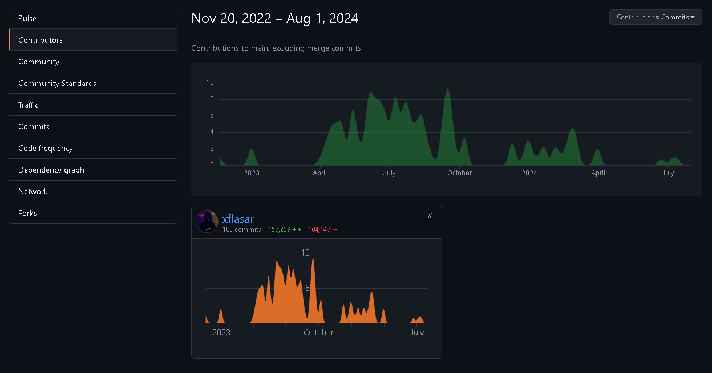

# WARNING!!! THIS IS ONLY CLIENT-SIDE OF ATORAXXIA WARNING!!!

# AS OF NOW 8/1/2024 THIS PROJECT WILL BE USED ONLY TO REVIEW CLIENT-SIDE CODE AND IT'S DEVELOPEMENT

# Idea

Atoraxxia is React based web application aming to ease users into Black Desert Online Game-World. It features Session management with all needed data for easier reviewing of user game-time. Marketplace "read-only" ( can change in future ) of current game marketplace with items and its data. News and announcements from Pearl Abyss (BDO) refreshed every 12 hours 00:00|12:00 UTC. User management, private/public sessions data, private/public profile (IN PLANNING). Global data from combination of all users with global usage option enabled ( This is strictly session data ).

# Previous Developement

This repository is separated CLIENT-SIDE folder ( Project ) from original repository.

Actual Developement is around 1 year and 7 months from start. This project is side-project developed in my own free time. Yet it is also learning project for React and Node with MongoDB and Redis caching for API.

# Release

It is planned to release Alpha into internet by the end of 2024. (Can be even earlier.)
